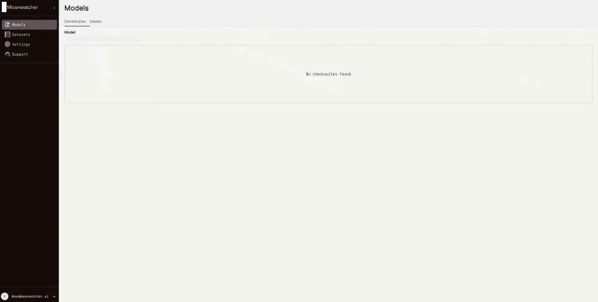

<picture>
  <source media="(prefers-color-scheme: dark)" srcset="https://github.com/moonwatcher-ai/moonwatcher/assets/735435/4e17639c-e82b-4f93-b70b-47472865e365">
  <source media="(prefers-color-scheme: light)" srcset="https://github.com/moonwatcher-ai/moonwatcher/assets/735435/bcbfd1ba-a3c6-420d-8cef-afc617205f83">
  
</picture>

# Web app
The web app allows users to investigate the check results and identify instances and patterns that cause your model to fail. Moreover, the check results can be shared with product, sales or customers to foster a common understanding of model quality and performance.

## Try the demo
You can log into our demo account at https://app.moonwatcher.ai/sign-in to get a better idea of the web app functionality 
with the following credentials:
- Email: demo@moonwatcher.ai
- Password: Demo123!

# Contents

- [1.👋 Sign Up](#sign-up)
- [2. 🔐 API](#API)
- [3. ⬆️ Upload](#upload)
- [4. 🔍 Analyze the results](#analyze-the-results)
  - [🧠 1. Models](#models)
  - [🖼️ 2. Datasets](#datasets)

## 1. 👋 Sign Up

Navigate to [https://app.moonwatcher.ai/sign-up](https://app.moonwatcher.ai/sign-up) to create your account. We have limited the number of accounts in the alpha version. If all accounts are already taken, please contact us.

> [!TIP]
> If you plan to share the results within your team, we recommend using an email and password that you're comfortable sharing with your colleagues. Currently, we only support one account per team.

## 2. 🔐 API

To analyze the results of the open-source library in the web app, you need to upload them via the Moonwatcher API. The upload requires an API Key and the endpoint URL. You can retrieve both from the Settings page.

Next, create an environment file `.env` in your root directory:

```python
#/.env

API_KEY=<your-API-key>
API_ENDPOINT=<endpoint-URL>
```

## 3. ⬆️ Upload

To display a dataset (the associated images and annotations) in the web app, take the following steps:

**1. Add locators to your dataset**

- A locator is a string representing a file URL that points to the image.
- Add a list of locators to the moonwatcher dataset.
- Example:

  ```python
  locators = ["https://path/to/image1","https://path/to/image2","https://path/to/image3",... ]

  mw_dataset = MoonwatcherDataset(
    dataset=your_dataset,
    ...
    locators = locators
  )
  ```

> [!WARNING]
> Locators must be external path strings, i.e., URLs starting with "https://".

> [!WARNING]
> The web app requires access to the file URL. If the file behind the URL is protected, the web app may not be able to access it.

**2. Upload the data**

- Delete your observations folder.
- Re-run the checks and check suites that you want to upload.
- Since you have added the `.env` file, the re-run will automatically trigger an upload of the relevant data.

> [!WARNING]
> If you don't delete the observations folder and re-run all the checks and check-suites, issues will occur.

## 4. 🔍 Analyze the results

The data and results are now uploaded and accessible with the account associated with the API key used for the upload.

You can start your analysis journey from two different starting points:

### 🧠 1. Models

Understand where your models fail at a glance. Navigate to the Models tab to display the results of associated checks and check suites.



To investigate the cause of a test failure, click on the slice or dataset to browse the images with their ground truth and model predictions.

### 🖼️ 2. Datasets

For an overview of all the datasets in use, navigate to the Datasets tab.


Explore the dataset, corresponding slices, and annotations to better understand how different models perform on subsets of your data.


> [!IMPORTANT]
> To visualize the images, ensure that Moonwatcher has access to the locator URLs.

# 🤝 Get in touch

If you have questions, need support, want to share feedback, contribute, or explore collaboration opportunities, feel free to reach out to us at hello@moonwatcher.ai.
